> Pietro Jomini :shipit:

# Es01

1. [Creare una rete composta dalle seguenti postazioni:](#1)

|     Nome | IP             |
| -------: | -------------- |
| Pc_Guido | 192.168.99.100 |
| Pc_Paolo | 192.168.99.101 |
|  Pc_Luca | 192.168.99.102 |

​	Connesse attraverso un `hub01` .

​	SubnetMask: `255.255.255.0`

2. [Effettuare ping/invio pacchetto tra Pc_Guido e PC_Luca, segnalare il risultato nel documento.](#2)
1. [Effettuare ping/invio pacchetto tra Pc_Paolo e PC_Luca, segnalare il risultato nel documento.](#3)
2. [Scrivere sul progetto quanto sono le sottoreti e di host che si possono rappresentare con questa configurazione.](#4)

+ [Considerazioni finali](#Considerazioni-finali)


## 1

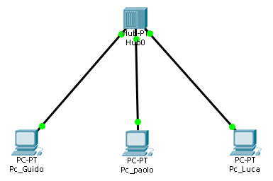

La rete è configurata come da consegna, con collegamenti tramite cavo di rame.


## 2

##### Possiamo verificare il **ping** tramite CMD:

``` bash
ping 192.168.99.102
```

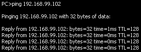

 

##### Oppure tramite GUI:

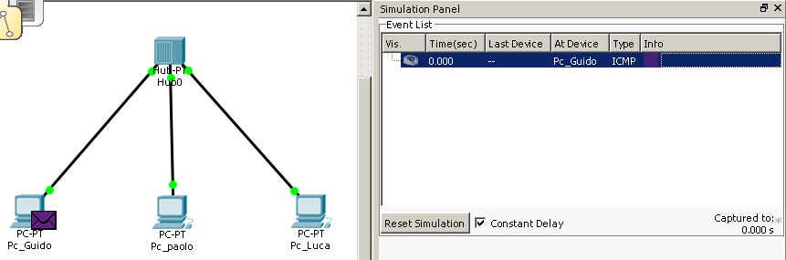

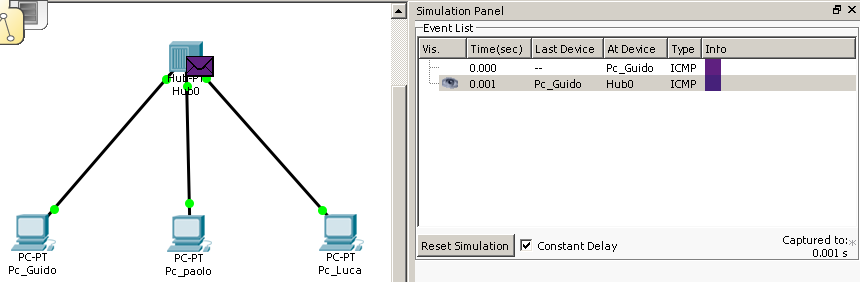

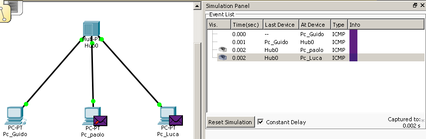

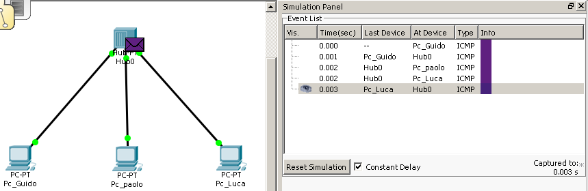

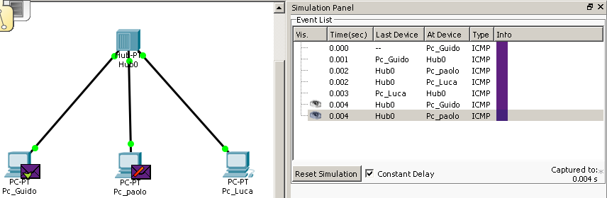

Si noti il percorso compiuto dai pacchetti.

lo satus della comunicazione cambia da `In Progress` a `Successfull`, se la comunicazione è andata a buon fine.

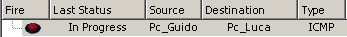


## 3

Operiamo similarmente a come operato nel punto [2](#2):

##### Tramite CMD:

``` bash
ping 192.168.99.102
```

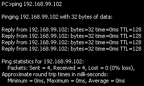

Si può notare il successo della comunicazione dal campo `lost`, che ci comunica che `0` pacchetti sono stati persi. 

##### Traite GUI:

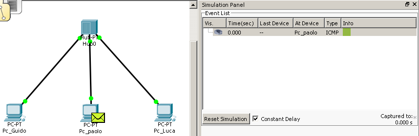

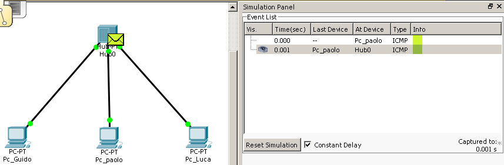

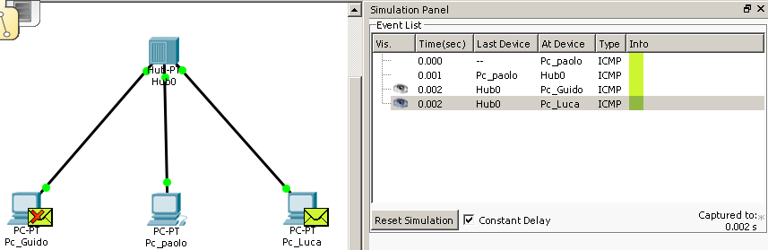

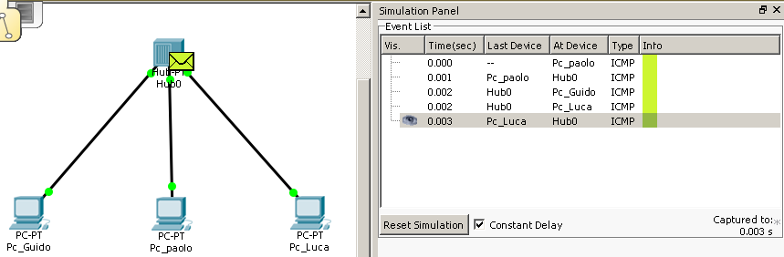

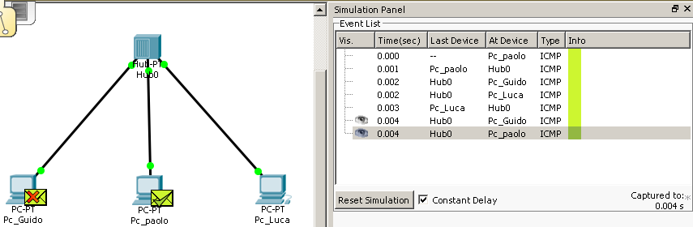

Si noti il percorso compiuto dai pacchetti.

lo satus della comunicazione cambia da `In Progress` a `Successfull`, se la comunicazione è andata a buon fine.


## Considerazioni finali

I pacchetti vengono semplicemente replicati dall'HUB su tutte le porte, essendo lui un dispositivo puramente meccanico. Sono poi i PC a accettare o meno il pacchetto.

Questo fenomeno si chiama **Flooding**

