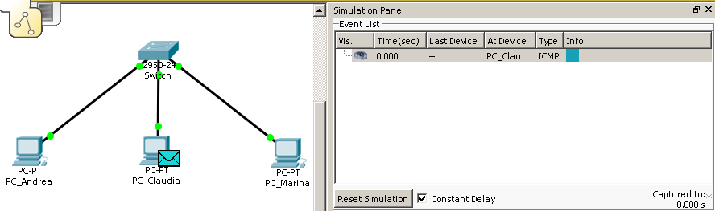
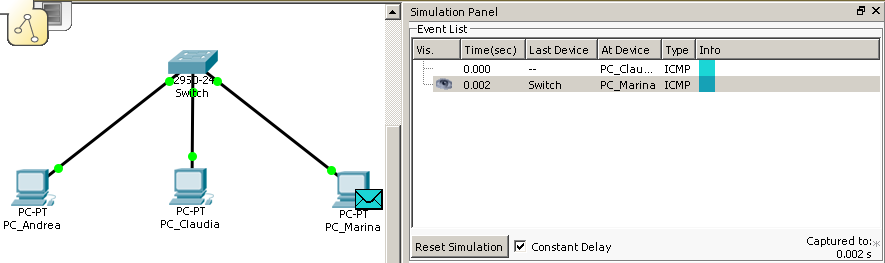
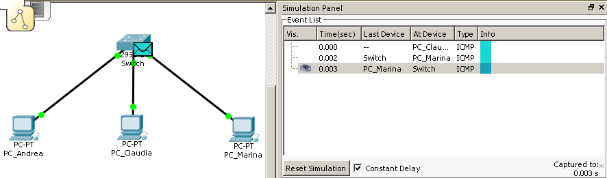
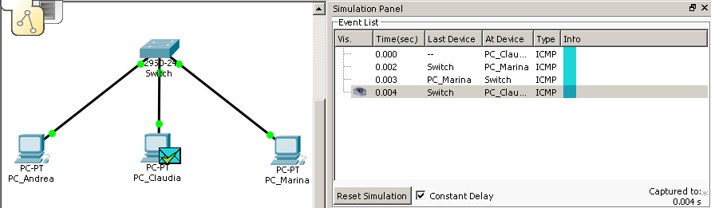
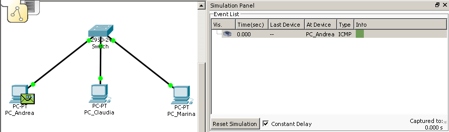
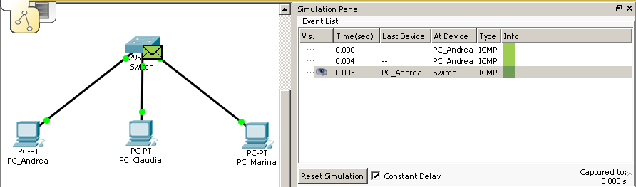
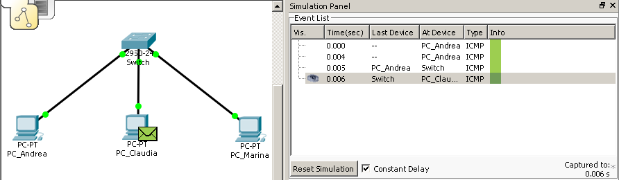
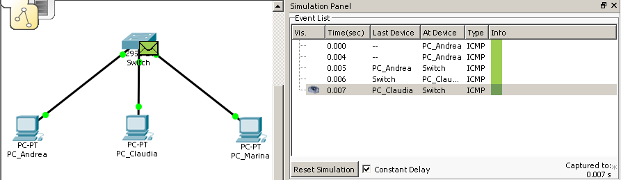
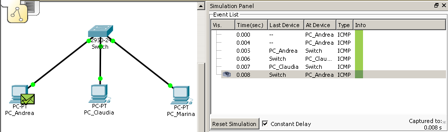

> Pietro Jomini :shipit:

# Es. 02

Creare una rete composta dalle seguenti postazioni:

|         PC | IP        |
| ---------: | --------- |
|  PC_Andrea | 10.0.0.20 |
| PC_Claudia | 10.0.0.22 |
|  PC_Marina | 10.0.0.24 |

Connesse attraverso un switch.

La subnetMask è 255.255.0.0

1. [Ping tra PC_Claudia e PC_Marina](#1)
2. [Ping tra PC_Andrea e PC_Claudia](#2)
3. [Calcolare il numero di sottoreti di host](#3)

- [Considerazioni](#Considerazioni) 

## 1

Si noti lo status positivo dell'operazione e la mancanza di flooding.

## 2

Anche in questo caso si può notare la mancanza di flooding.

## 3

Le sottoreti di host disponibili sono: 

`254 * 254 = 64516 `

## Considerazioni

Si può notare come lo switch, essendo a livello più altro dell'hub, indirizza il pacchetto, evitando flooding.