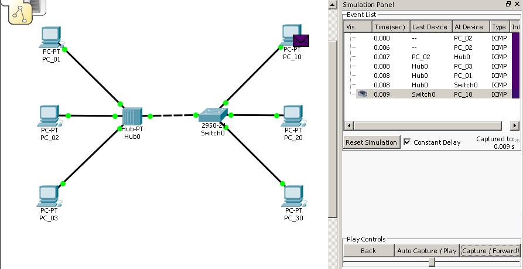

> Pietro Jomini :shipit:

# Es. 03

Creare una prima rete composta dalle seguenti postazioni:

|    PC | IP            |
| ----: | ------------- |
| PC_01 | 192.168.13.64 |
| PC_02 | 192.168.13.67 |
| PC_03 | 192.168.13.70 |

Connesse attraverso un hub.

Creare una seconda rete composta dalle seguenti postazioni:

|    PC | IP            |
| ----: | ------------- |
| PC_10 | 192.168.13.75 |
| PC_20 | 192.168.23.65 |
| PC_30 | 192.168.23.66 |

Connesse attraverso uno switch

la SubnetMask è 255.255.255.0

Connettere l'hub allo switch tramite cavo ethernet.

1. [Ping tra PC_01 e PC_03](#1)
2. [Ping tra PC_02 e PC_10](#2)
3. [Ping tra PC_03 e PC_30](#3)
4. [Ping tra PC_10 e PC_2](#4)

## 1

La comunicazione avviene con successo.

Si noti come il pacchetto, date le caratteristiche dell'hub, viene mandato a tutti i pc connessi all'hub, compreso lo switch.

Ciò avviene sia durante l'invio da parte di PC_01 che durante la conferma da parte di PC_02

## 2

Anche in questo caso, il pacchetto viene inviato, sia in 'uscita' che in 'entrata', a tutto il gruppo di pc connessi all'hub

 

In questo caso lo switch accetta però il messaggio, inoltrandolo al PC_10

Il ping termina po con successo

## 3

Cercando di inviare pacchetti tra PC_03 e PC_30 il ping termina con status 'failed'.

Analizzando i rispettivi IP:
|    PC | IP            |
| ----: | ------------- |
| PC_03 | 192.168.13.70 |
| PC_30 | 192.168.23.66 |

Si nota che sono uguali solo per i primi 2 blocchi.

Dato che la SubnetMask è 255.255.255.0, i due PC appartengono a due gruppi diversi, dunque, dato che ne l'hub ne lo Switch operano a livello internet, i due PC non possono comunicare.

## 4

Provando a mandare messaggi tra il PC_10 e il PC_20 avviene una situazione analoga al punto [3](#3).

Cambiando la Subnetmask da `255.255.255.0` a `255.255.0.0`, i due PC rientrano nello stesso gruppo, dunque possono comunicare.

